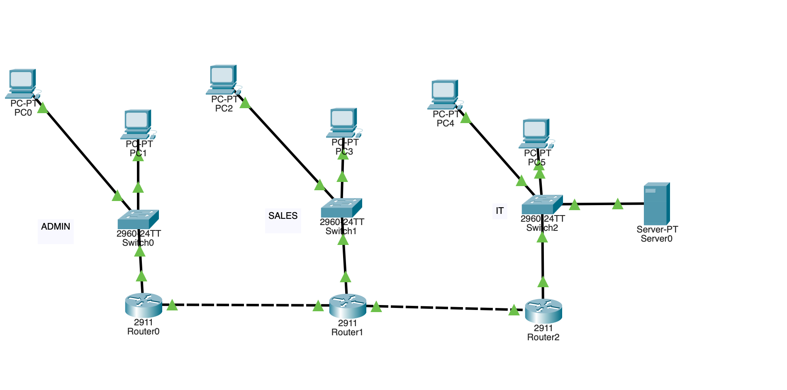
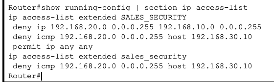
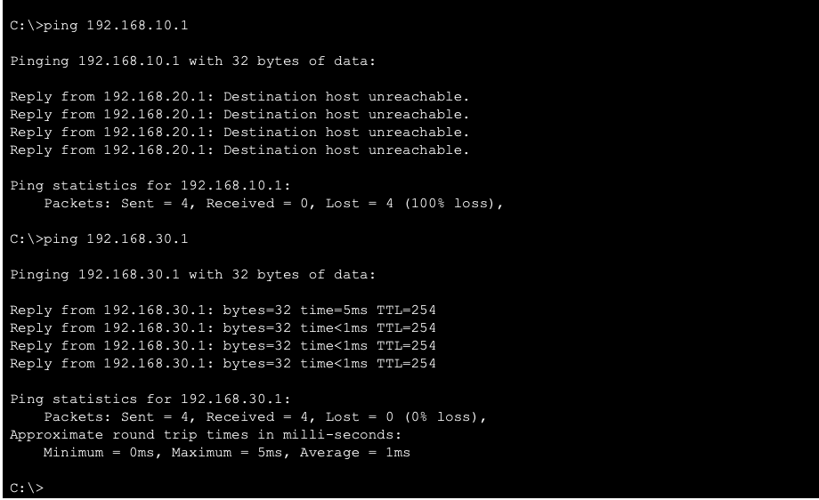
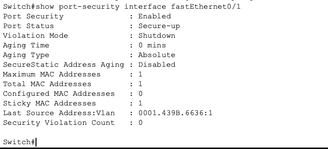

# Lab 04 — ACLs & Network Security

## Overview

This Cisco Packet Tracer lab demonstrates the implementation of Layer 3 access control and Layer 2 switch security in a multi-network environment.

The lab builds on my previous routing lab by implementing standard and extended Access Control Lists (ACLs), protocol-specific traffic filtering, and switch port security. Each security policy was tested to verify that unauthorized traffic was blocked while legitimate network services remained accessible.

## Network Topology



### Networks

| Department | Network | Purpose |
|---|---|---|
| Admin | `192.168.10.0/24` | Administrative users |
| Sales | `192.168.20.0/24` | Sales users |
| IT / Server | `192.168.30.0/24` | IT devices and network services |

**Web Server:** `192.168.30.10`

---

## Security Objectives

The following policies were implemented:

- Block Sales devices from accessing the Admin network.
- Allow Sales devices to continue accessing authorized networks.
- Block ICMP traffic from Sales to the IT web server.
- Allow HTTP access from Sales to the same server.
- Restrict access to the IT network using a standard source-based ACL.
- Configure switch port security with sticky MAC learning.
- Limit the secured switch port to one authorized MAC address.

---

## Extended ACL — SALES_SECURITY

A named extended ACL was configured on Router1:

```text
ip access-list extended SALES_SECURITY
 deny ip 192.168.20.0 0.0.0.255 192.168.10.0 0.0.0.255
 deny icmp 192.168.20.0 0.0.0.255 host 192.168.30.10
 permit ip any any
```

This ACL demonstrates filtering based on:

- Source network
- Destination network
- Protocol
- Specific destination host
- Rule order and implicit deny behavior

The ACL was applied inbound near the Sales source network.

### Extended ACL Configuration



---

## Standard ACL — ADMIN_ONLY

A standard ACL was configured to permit traffic sourced from the Admin network:

```text
ip access-list standard ADMIN_ONLY
 permit 192.168.10.0 0.0.0.255
```

Because standard ACLs filter based only on the source IP address, the ACL was positioned close to the destination network.

Traffic not matching the permit statement is rejected by the implicit deny.

---

## ACL Verification

Connectivity testing was performed before and after applying the security policies.

| Traffic Test | Result |
|---|---|
| Sales → Admin | ❌ Blocked |
| Sales → IT Router | ✅ Allowed |
| Sales → Web Server using ICMP | ❌ Blocked |
| Sales → Web Server using HTTP | ✅ Allowed |
| Admin → IT Server | ✅ Allowed |
| Unauthorized source → IT Server | ❌ Blocked |

### Connectivity Testing



The testing demonstrated that the extended ACL could block one protocol while permitting another protocol between the same networks.

---

## Switch Port Security

Port security was configured on `Switch0 FastEthernet0/1`.

```text
interface FastEthernet0/1
 switchport mode access
 switchport port-security
 switchport port-security maximum 1
 switchport port-security mac-address sticky
```

The switch dynamically learned the authorized device's MAC address using sticky MAC learning.

### Port Security Configuration

- Port Security: **Enabled**
- Port Status: **Secure-up**
- Maximum MAC Addresses: **1**
- Sticky MAC Learning: **Enabled**
- Violation Mode: **Shutdown**



---

## Skills Demonstrated

- Cisco IOS CLI configuration
- Standard ACLs
- Extended ACLs
- Named ACLs
- Wildcard masks
- ACL sequence and rule ordering
- Inbound and outbound ACL placement
- Protocol-specific filtering
- Implicit deny behavior
- ICMP and HTTP connectivity testing
- ACL verification and troubleshooting
- Switch port security
- Sticky MAC address learning
- Layer 2 and Layer 3 security controls

---

## Tools Used

- Cisco Packet Tracer
- Cisco IOS CLI
- GitHub

---

## Key Takeaway

This lab demonstrates how ACLs and switch port security can be used together to enforce network security policies. Rather than simply blocking connectivity, the network was configured to selectively control communication based on source, destination, and protocol while preserving authorized services.
